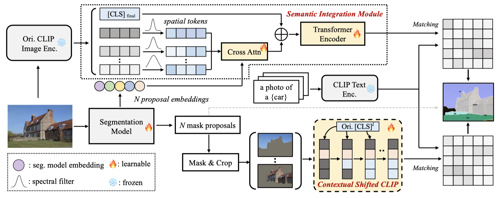
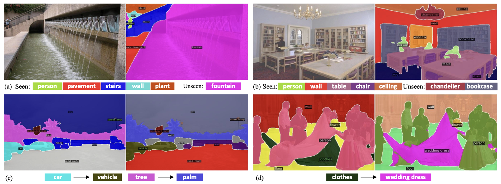
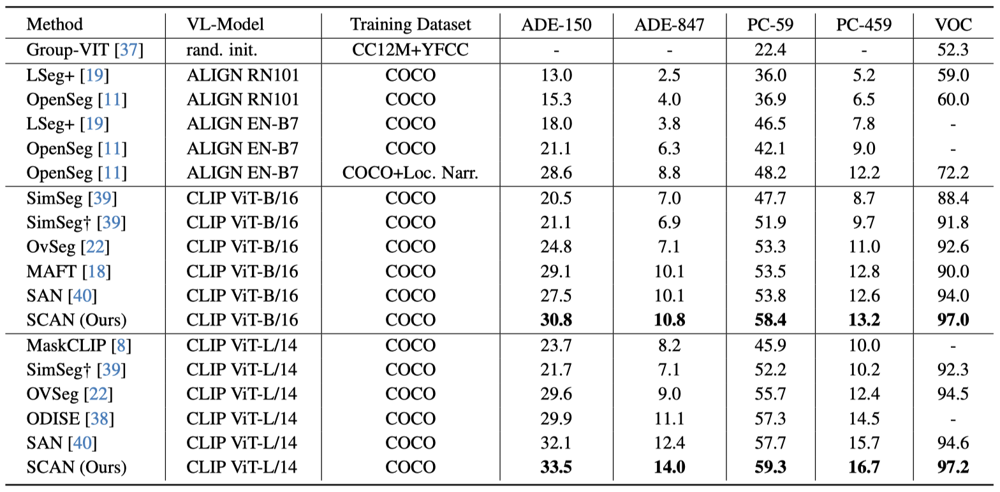

# Open-Vocabulary Segmentation with Semantic-Assisted Calibration
Yong Liu*, Sule Bai*, Guanbin Li, Yitong Wang, Yansong Tang
(*equal contribution)

The repository contains the official implementation of "Open-Vocabulary Segmentation with Semantic-Assisted Calibration"

[Paper](https://arxiv.org/abs/2312.04089)

 

## 📖 Abstract
This paper studies open-vocabulary segmentation (OVS) through calibrating in-vocabulary and domain-biased embedding space with  generalized contextual prior of CLIP. As the core of open-vocabulary understanding, alignment of visual content with the semantics of unbounded text has become the bottleneck of this field. To address this challenge, recent works propose to utilize CLIP as an additional classifier and aggregate model predictions with CLIP classification results. Despite their remarkable progress, performance of OVS methods in relevant scenarios is still unsatisfactory compared with supervised counterparts. We attribute this to the in-vocabulary embedding and domain-biased CLIP prediction. To this end, we present a Semantic-assisted CAlibration Network (SCAN). In SCAN, we incorporate generalized semantic prior of CLIP into proposal embedding to avoid collapsing on known categories. Besides, a contextual shift strategy is applied to mitigate the lack of global context and unnatural background noise. With above designs, SCAN achieves state-of-the-art performance on all popular open-vocabulary segmentation benchmarks. Furthermore, we also focus on the problem of existing evaluation system that ignores semantic duplication across categories, and propose a new metric called Semantic-Guided IoU (SG-IoU).

---
## 📖 Pipeline

 

## 📖 Visualization

 

## 📖 Results

 

## 🎤🎤🎤 Todo

- [ ] Release the code and checkpoint